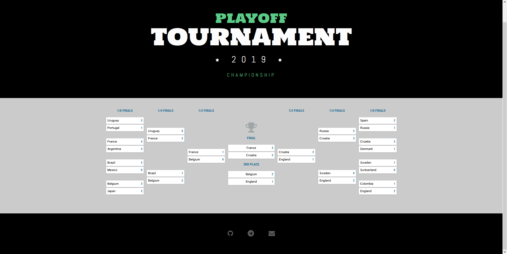

# Playoff tournament

**Objective of the project**:

This project implements the “Tournament grid” functionality, as well as the administrative interface for its management.
The tournament grid has a knockout type. 
It is based on the participation of 2 teams, of which one winner goes to the next round.
Examples of tournament nets can be found in the search engine 
[link](https://duckduckgo.com/?q=tournament+grid&t=h_&ia=web)

A tournament grid is built in the public interface.
In the administrative interface, control this grid. Tournament grid data is saved to the database.
The administrative section displays a report on commands with fields:

* “Team”;
* “place in the tournament”;
* “overall team performance in points / goals for the entire tournament”;
* “average performance per match”;
* “best performance per match”.

# Screenshots

Main page full:


Main page tournament grid:


Admin panel - Tournament statistics:


Admin panel - Tournament matches:


# Install

1. Copy and edit env file:
    ```bash
    cp .env.example .env
    ```

2. Install dependencies:

    ```bash
    composer install
    ```
3. Install admin-panel:

    ```bash
    php artisan admin:install
    ```
4. Refresh migrations (some problem with admin_menu inserting):

    ```bash
    php artisan migrate:refresh --path=/database/migrations/2019_08_22_014400_create_playoff_admin_menu.php
    ```

5. **(Optional)** Complete seeds for example data (teams, matches, tournament, tournament matches):

    ```bash
    php artisan db:seed
    ```

6. See main page on `http://localhost/`.

7. See admin panel on `http://localhost/admin`.
   Login: `admin`, Password: `admin`.

Thanks `Joe Beason` for design ([link](https://codepen.io/jbeason/full/Wbaedb/)).

@kovalevcon
